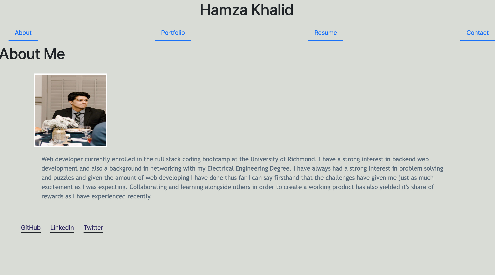

# reactPortfolio
## Description
This is a personal portfolio created using React. It utilizes a header and footer that stay throughout the whole operation of the webpage while adding content to the body based on the corresponding nav option the user selects. Various forms of contact are shown at the footer as well as a contact form that validates if the correct formatting for a contact email is used. 6 deployed projects are also shown with screenshots and links in the portfolio portion as well.

Although It could used some styling and TLC in the future this app taught me how to create and host apps using react. 

## Technlogies used
* Javascript
* React.js
* CSS
* HTML5
* Github Pages

## Usage
Please click the link below to view the deployed Portfolio

## License 
MIT License

            Copyright (c) 2021 Hamza Khalid
            
            Permission is hereby granted, free of charge, to any person obtaining a copy of this software and associated documentation files (the "Software"), to deal in the Software without restriction, including without limitation the rights to use, copy, modify, merge, publish, distribute, sublicense, and/or sell copies of the Software, and to permit persons to whom the Software is furnished to do so, subject to the following conditions:
            
            The above copyright notice and this permission notice shall be included in all copies or substantial portions of the Software.
            
            THE SOFTWARE IS PROVIDED "AS IS", WITHOUT WARRANTY OF ANY KIND, EXPRESS OR IMPLIED, INCLUDING BUT NOT LIMITED TO THE WARRANTIES OF MERCHANTABILITY, FITNESS FOR A PARTICULAR PURPOSE AND NONINFRINGEMENT. IN NO EVENT SHALL THE AUTHORS OR COPYRIGHT HOLDERS BE LIABLE FOR ANY CLAIM, DAMAGES OR OTHER LIABILITY, WHETHER IN AN ACTION OF CONTRACT, TORT OR OTHERWISE, ARISING FROM, OUT OF OR IN CONNECTION WITH THE SOFTWARE OR THE USE OR OTHER DEALINGS IN THE SOFTWARE
            
## Badges

## Live Deployement 
https://hkhalid2.github.io/reactPortfolio/

### Screenshot

